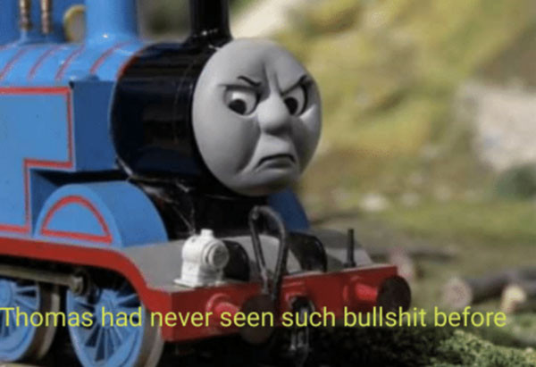

<h1>Train Thomas and Adam</h1>

## Alda's notes

1. Research - 4 hours
2. Understand the problem - 4 hours
3. Set up the project (Hosting, CI, Database) - 12 hours
4. Design (just consultation) - 4 hours
5. Implement (Django models, Backend) - 12 hours
6. Meetings - 4 hours

Overall: 40 hours - 15 000 Kč (375 Kč/hour)

## Sochy's notes

1. Understand the problem - 4 hours
2. Design (Figma) - 12 hours
3. Implement (Frontend) - 20 hours
4. Meetings - 4 hours

Overall: 40 hours - 10 000 Kč (250 Kč/hour)